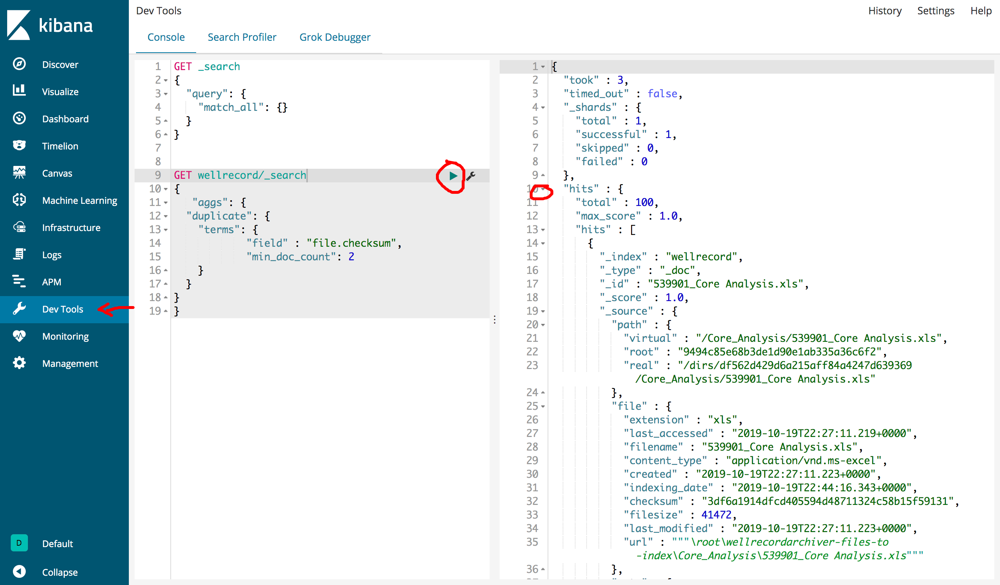
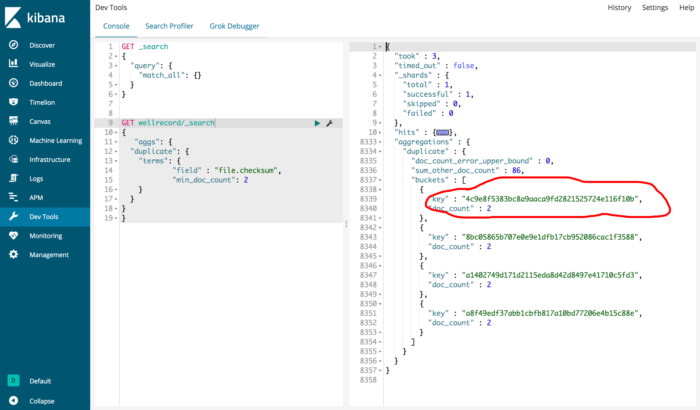
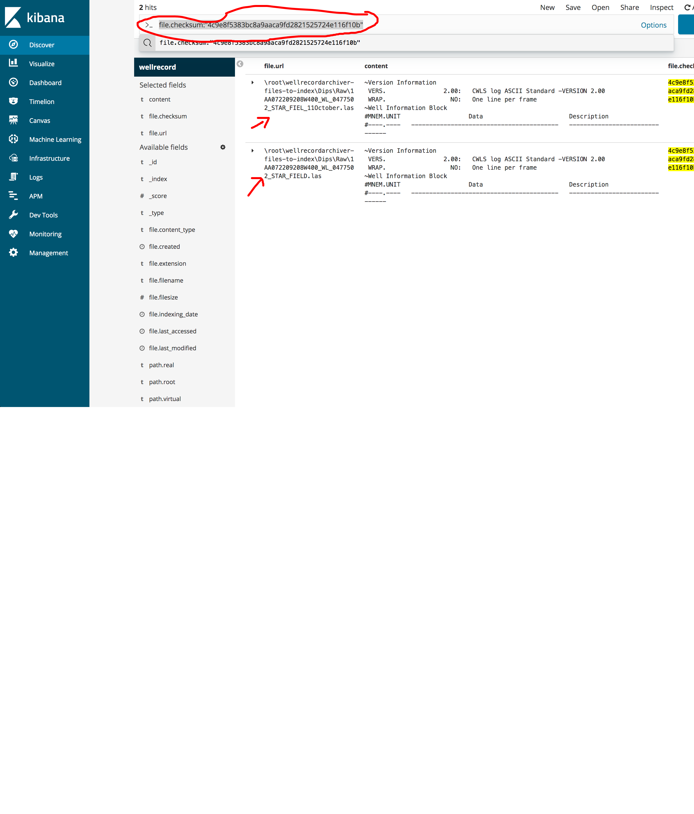

.. _duplication:

======================
Detect duplicate files
======================

Generally, Duplicate files in the sense the files have absolutely identical content, size and extensions but might have different file names. Having so many duplicate files creates a mess and disarray in the system.

Steps to detect duplicates
~~~~~~~~~~~~~~~~~~~~~~~~~~

As per investigation, The best approach to find duplicate files over a large no.of files is based on checksum/hash value (MD5/SHA1) of a the files.

So that, by comparing the hash we can easily find the duplicate files since the hash values are unique for identical contents.

Indexing files
--------------

We are going to use FScrawler to index all the files, then Elasticsearch find duplicates.

File checksum
-------------

We want FSCrawler to generate a SHA1 checksum for each file. We can achieve that by setting ``fs.checksum`` property as ``SHA1`` in  ``~/.fscrawler/test/_settings.json`` file.

.. code:: json

  {
     "name": "job name",
     "fs": {
       "checksum": "SHA1"
     }
   }

Use Bucket Aggregation to search for duplicates
-----------------------------------------------

Quering in Kibana to find duplicates files based on the checksum value.

.. code:: json

    GET wellrecord/_search
    {
       "aggs": {
       "duplicate": {
          "terms": {
                "field" : "file.checksum",
                "min_doc_count": 2
          }
          }
       }
    }

A bucket mainly consists of a key i.e, ``checksum`` and a document. When the aggregation is executed, the documents are placed in the respective bucket. So finally we should have a list of buckets, each with a list of files.

Then grab a checksum and query for that.

.. code-block:: bash

 file.checksum:"4c9e8f5383bc8a9aaca9fd2821525724e116f10b"

TEST URL:  https://kibana.geolinkis.bowriverstudio.com/app/kibana#/discover?_g=()&_a=(columns:!(file.url,content,file.checksum),index:'35b4d770-f353-11e9-9b29-7300828b605e',interval:auto,query:(language:lucene,query:'file.checksum:"4c9e8f5383bc8a9aaca9fd2821525724e116f10b"'),sort:!(_score,desc))

