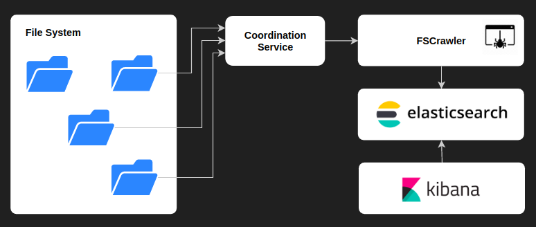

.. Backup solution for docker deployment documentation master file, created by
   sphinx-quickstart on Sun Jun 30 00:13:06 2019.
   You can adapt this file completely to your liking, but it should at least
   contain the root `toctree` directive.

=====================================================
Indexing Directories With ElasticSearch And FSCrawler
=====================================================

.. toctree::
   :caption: Content:

   how
   setup
   run
   kibana
   overview

.. toctree::
   :caption: Setup:

   setup/install
   setup/digitalocean
   setup/ubuntu

About this project
------------------

This project's purpose is crawling content from various file extensions (pdf, doc, csv, xls, xlsx and las) ignores (.zip) and create an index manageable from an ElasticSearch node.

.. toctree::
   :caption: Duplicate:
   :hidden:

   duplicate/index

.. toctree::
   :caption: OCR:
   :hidden:

   ocr/benchmarking
   pdf/index

.. toctree::
   :caption: Next Steps:
   :hidden:

   projects/next-steps

.. toctree::
   :caption: Notes:
   :hidden:

   projects/tasks
   projects/documentation
   projects/notes
   ocr/index
   ocr/google-vision
   ocr/microsoft-vision
   ocr/rekognition
   ocr/textract

