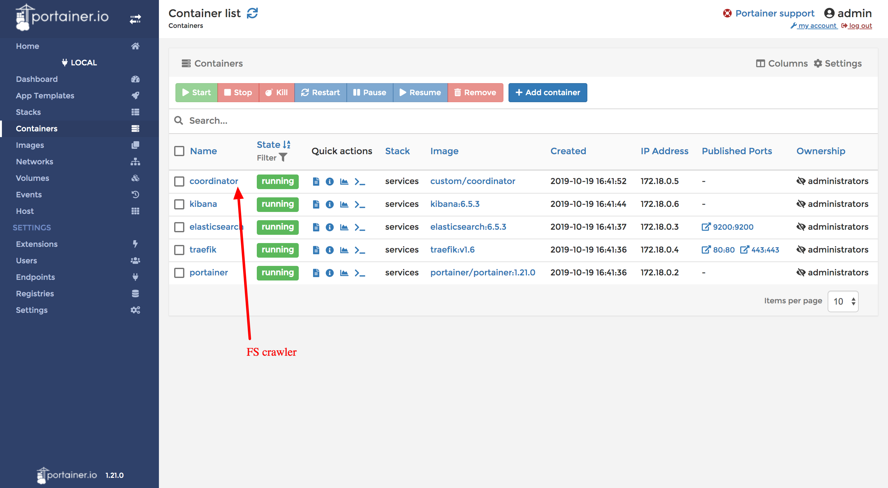

Overview
=========

This project's purpose is crawling content from various file extensions (pdf, doc, csv, xls, xlsx and las) ignores (.zip) and create an index manageable from an ElasticSearch node.

.. image:: _static/flow.png

Technology Used

FScrawler
---------

Overview
........

FScrawler is an opensource crawler helps to index binary documents such as PDF, Open Office, MS Office.  It is built and maintained by David Pilato a fulltime employee of Elastic Search.

Main features:

- Local file system (or a mounted drive) crawling and index new files, update existing ones and removes old ones.
- Remote file system over SSH crawling.
- REST interface to let you “upload” your binary documents to elasticsearch.

https://fscrawler.readthedocs.io/en/latest/

PDFs
....

We evulated the strongest OCR libraries:
 - https://aws.amazon.com/rekognition/
 - https://aws.amazon.com/textract
 - https://cloud.google.com/vision/docs/ocr
 - https://docs.microsoft.com/en-us/azure/cognitive-services/computer-vision/concept-recognizing-text

FScrawler uses apache tika to extracts metadata and text from thousand different file types.  One limitation is it uses TikaOCR for the OCR.  We choose to evaluate :ref:`ocr_benchmarking`

https://tika.apache.org/

Forking Fscrawler
.................

Based on the benchmarking and we chose to use the microsoft vision.

Main differences occur here: https://github.com/Bowriverstudio/fscrawler/tree/master/tika/src/main/java/fr/pilato/elasticsearch/crawler/fs/tika/customparser

Microsoft Computer Vision
-------------------------

Extract rich information from images to categorize and process visual data—and perform machine-assisted moderation of images to help curate your services.

Sample:

.. code-block:: bash

   Sorry!

   Have a

   Oops!

   nice day !

   See you soon !

   Bye !

https://docs.microsoft.com/en-us/azure/cognitive-services/computer-vision/concept-recognizing-text

Elastic Search
--------------

Elasticsearch is a search engine based on the Lucene library. It provides a distributed, multitenant-capable full-text search engine with an HTTP web interface and schema-free JSON documents

All the data extracted from fscrawler is stored in elastic search.

Kibana
------

Kibana lets you visualize your Elasticsearch data and navigate the Elastic Stack so you can do anything from tracking query load to understanding the way requests flow through your apps.

.. image:: _static/illustrated-screenshot-hero-kibana.png

Kibana is opensource, and custom dashboards can be added. This allows us to use the domain expertise of geolinkis to build advanced dashboards.

.. note:: Sample https://kibana.geolinkis.bowriverstudio.com

https://www.elastic.co/guide/en/kibana/current/tutorial-build-dashboard.html

Docker
------

Leading companies rely on docker's container platform to build, manage and secure all their applications from traditional applications to cutting-edge microservices—and deploy them anywhere.

https://docker.com

Portainer
----------

Portainer is a lightweight management UI which allows you to easily manage your Docker host.

.. note:: Sample https://portainer.geolinkis.bowriverstudio.com

    admin
    fasdjipajsofiphui9h23

Traefik
-------

Handles the reverse DNS to manage the container's communication.

Maven
-----

Compiles the Java (In progress)