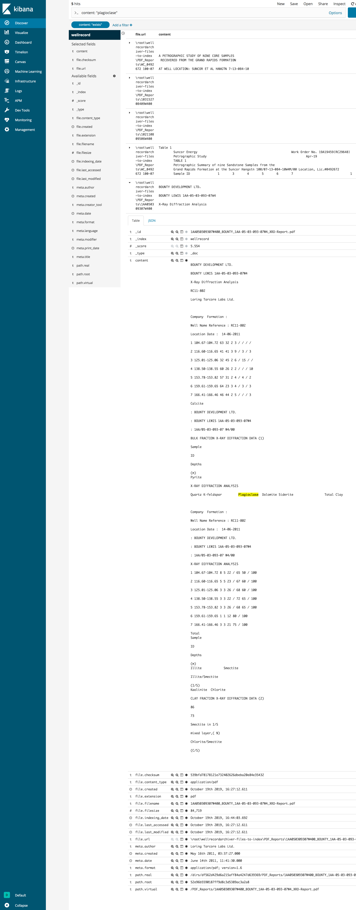

PDF
===

Sample
------

View a PDF let us say:

https://gitlab.com/geolinkis/wellrecordarchiver-files-to-index/blob/master/PDF_Reports/103152708409W400_XRD_a10137-6%20%20B_C%20%20Petro-Canada_2003.pdf

Extract some text ie: "plagioclase"

Then goto Kibana and search for it.

https://kibana.geolinkis.bowriverstudio.com/app/kibana#/discover?_g=()&_a=(columns:!(file.url,content,file.checksum),filters:!(('$state':(store:appState),exists:(field:content),meta:(alias:!n,disabled:!f,index:'35b4d770-f353-11e9-9b29-7300828b605e',key:content,negate:!f,type:exists,value:exists))),index:'35b4d770-f353-11e9-9b29-7300828b605e',interval:auto,query:(language:lucene,query:'content:%20%22plagioclase%22'),sort:!(_score,desc))

Result
------

